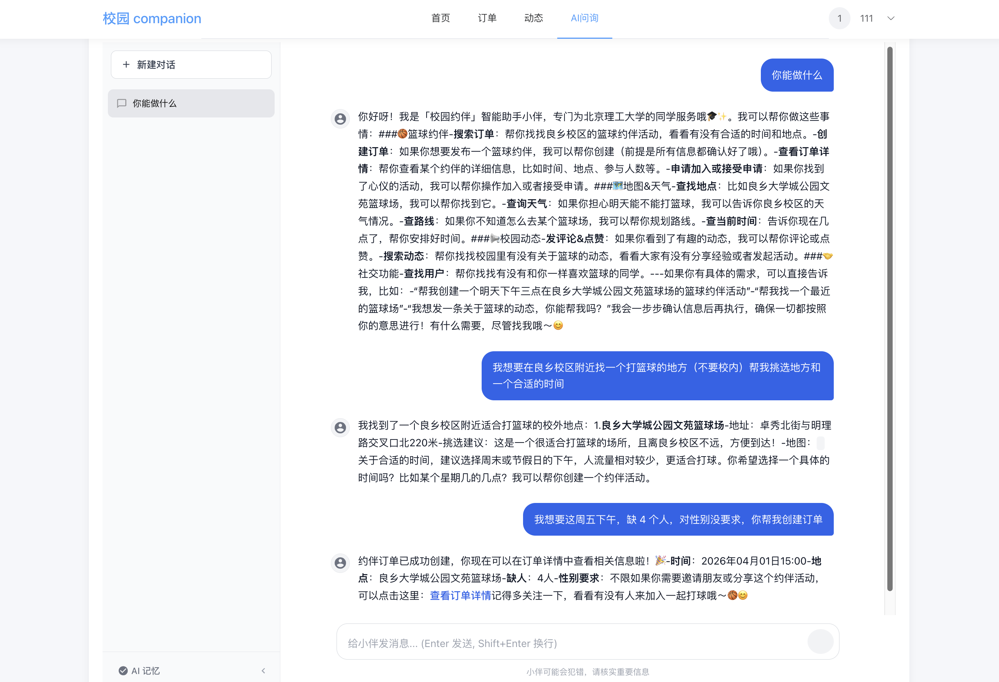

# 校园约伴系统 - Campus Companion

[](LICENSE)
[](https://spring.io/projects/spring-boot)
[](https://vuejs.org/)
[](https://www.python.org/)
[](https://www.langchain.com/)

> 本项目为北京理工大学2023级计算机学院本科生**谷奕辰、孙健柏、伍奕涛、张元宏**四位同学的专业限选课《移动互联分析与设计》的结课作业项目

## 项目概述

校园约伴系统（Campus Companion）是一款面向校园用户的综合性社交平台，旨在解决校园内学生之间约伴进行各类活动（如运动、聚餐、学习、娱乐等）的需求。系统采用前后端分离架构，提供**移动端 App**、**Web 前端**、**Java 后端**和**Python AI 智能体**四端支持。

### 核心功能

- **活动约伴**：发布和参与各类校园活动（运动、聚餐、学习、娱乐等）
- **动态社区**：发布动态、评论互动、点赞分享
- **AI 智能体**：多智能体架构的校园助手，支持约伴管理、地图搜索、天气查询、动态互动等
- **用户系统**：完整的用户认证、信息管理功能
- **实时聊天**：活动参与者之间的消息交流
- **活动管理**：活动申请、审批、状态管理、历史记录

## 系统架构

```
┌─────────────┐   ┌─────────────┐
│  移动端 App   │   │  Web 前端    │
│  (uni-app)   │   │  (Vue 3)    │
└──────┬───────┘   └──────┬──────┘
       │                  │
       └────────┬─────────┘
                │ HTTP / SSE
                ▼
       ┌─────────────────┐         ┌──────────────────────┐
       │  Java 后端        │  HTTP   │  Python AI Agent     │
       │  (Spring Boot)   │ ◄─────► │  (LangChain/LangGraph)│
       │  :8080           │         │  :5001               │
       └────────┬─────────┘         └──────┬───────────────┘
                │                          │
                ▼                          ▼
         ┌───────────┐            ┌──────────────────┐
         │  MySQL     │            │  高德地图 MCP     │
         │  :3306     │            │  (天气/地图/路线) │
         └───────────┘            └──────────────────┘
```

### 技术栈

| 层级 | 技术 |
|------|------|
| **移动端** | uni-app (Vue 3) + Vuex 4 |
| **Web 前端** | Vue 3 + Vite + Element Plus + Pinia |
| **Java 后端** | Spring Boot 4.0 + JDK 21 + Spring Data JPA + MySQL |
| **AI 智能体** | Python 3.9 + LangChain + LangGraph + FastAPI |
| **LLM** | Qwen3-32B (硅基流动 SiliconFlow API) |
| **地图服务** | 高德地图 MCP Server (ModelScope) |

## AI 智能体架构

系统采用**多智能体协作架构**（子 Agent 作为工具模式）：

```
用户消息
  │
  ▼
┌──────────────────────────────────────┐
│  主 Agent (ReAct 循环)                │
│  职责：理解用户意图，调度子 Agent，     │
│       整合结果生成最终回复              │
│                                      │
│  工具：                               │
│  - call_order_agent(task)            │
│  - call_social_agent(task)           │
│  - call_map_agent(task)              │
└──────────┬──────────┬───────────┘
           │          │           │
     ┌─────▼──┐ ┌─────▼──┐ ┌─────▼────┐
     │ 订单    │ │ 社交    │ │ 地图天气  │
     │ Agent  │ │ Agent  │ │ Agent    │
     │ 8 工具 │ │ 6 工具 │ │ 7 工具   │
     └────────┘ └────────┘ └──────────┘
```


### 子 Agent 工具清单

**订单 Agent** — 约伴活动管理
- `search_orders` / `create_order` / `get_my_orders` / `get_order_detail`
- `apply_to_order` / `get_order_applications` / `accept_applicant` / `complete_order`

**社交 Agent** — 校园动态与用户
- `search_contents` / `get_content_detail` / `create_comment` / `like_content`
- `get_user_profile` / `search_users`

**地图天气 Agent** — 位置与环境信息（通过高德 MCP Server）
- `maps_text_search` / `maps_around_search` / `maps_geo`
- `maps_weather` / `maps_direction_walking` / `maps_direction_driving`
- `get_current_datetime`

### 智能体特性

- **行为约束**：只读操作直接执行，写操作（创建订单、发评论等）必须用户确认后才执行
- **跨域协作**：主 Agent 可同时调多个子 Agent，如"查天气 + 搜活动"一次完成
- **地图展示**：搜索到地点后在对话中内嵌静态地图
- **前端导航**：回复中的链接可直接跳转到对应的前端页面
- **用户记忆**：自动从对话中提取用户偏好，跨会话保持

## 快速开始

### 环境要求

- **JDK** 21+
- **Python** 3.9+
- **Node.js** 16+
- **MySQL** 8.0+
- **Maven** 3.6+（或使用项目自带的 `mvnw`）

### 1. 数据库配置

```sql
CREATE DATABASE campus_companion CHARACTER SET utf8mb4 COLLATE utf8mb4_unicode_ci;
```

修改 `CampusCompanionBackend/src/main/resources/application.properties`：

```properties
spring.datasource.username=your_username
spring.datasource.password=your_password
```

后端使用 JPA 自动建表（`spring.jpa.hibernate.ddl-auto=update`）。

### 2. AI 智能体配置

创建 `CampusCompanionAgent/.env`：

```env
# 硅基流动 API
SILICONFLOW_API_KEY=your_siliconflow_api_key
SILICONFLOW_MODEL=Qwen/Qwen3-32B

# Java 后端地址
JAVA_BACKEND_URL=http://localhost:8080

# 高德地图 MCP Server
AMAP_MCP_URL=https://mcp.api-inference.modelscope.net/your_mcp_id/sse
```

安装 Python 依赖：

```bash
cd CampusCompanionAgent
python3 -m venv venv
source venv/bin/activate
pip install -r requirements.txt
```

### 3. 一键启动

```bash
# 启动后端（MySQL + Python Agent + Java Backend）
bash start-backend.sh

# 启动前端
bash start-frontend.sh
```

停止服务：

```bash
bash stop-backend.sh
bash stop-frontend.sh
```

### 手动启动

```bash
# 1. Python AI Agent
cd CampusCompanionAgent
source venv/bin/activate
python -m uvicorn app.main:app --host 0.0.0.0 --port 5001

# 2. Java 后端
cd CampusCompanionBackend
./mvnw spring-boot:run

# 3. Web 前端
cd CampusCompanionWeb
npm install && npm run dev
```

服务地址：
- Java 后端：`http://localhost:8080`
- Python Agent：`http://localhost:5001`
- Web 前端：`http://localhost:5173`

## 项目结构

```
mobile_internet_design-project/
├── CampusCompanionBackend/         # Java 后端 (Spring Boot)
│   └── src/main/java/.../
│       ├── controller/             # REST 控制器
│       ├── service/                # 业务逻辑层
│       ├── repository/             # 数据访问层
│       ├── entity/                 # JPA 实体
│       ├── dto/                    # 请求/响应 DTO
│       ├── enums/                  # 枚举（活动类型、校区等）
│       ├── config/                 # 安全、CORS 等配置
│       └── exception/              # 全局异常处理
│
├── CampusCompanionAgent/           # Python AI 智能体
│   ├── app/
│   │   ├── main.py                 # FastAPI 入口
│   │   ├── agent.py                # 多智能体架构（主 Agent + 子 Agent）
│   │   ├── prompts.py              # 各 Agent 的 System Prompt
│   │   ├── tools.py                # 订单基础工具
│   │   ├── tools_order.py          # 订单扩展工具
│   │   ├── tools_content.py        # 动态/社交工具
│   │   ├── tools_user.py           # 用户工具
│   │   ├── tools_utils.py          # 时间查询等工具
│   │   ├── mcp_tools.py            # 高德地图 MCP 集成
│   │   ├── backend_client.py       # Java 后端 HTTP 客户端
│   │   └── config.py               # 环境配置
│   ├── .env                        # 敏感配置（已 gitignore）
│   └── requirements.txt
│
├── CampusCompanionWeb/             # Vue 3 Web 前端
│   └── src/
│       ├── views/                  # 页面（AI、订单、动态、用户等）
│       ├── services/               # API 服务层
│       ├── stores/                 # Pinia 状态管理
│       ├── router/                 # 路由配置
│       └── components/             # 通用组件
│
├── CampusCompanionApp/             # uni-app 移动端
├── docs/                           # 项目文档
├── start-backend.sh                # 后端一键启动脚本
├── stop-backend.sh                 # 后端停止脚本
├── start-frontend.sh               # 前端启动脚本
└── stop-frontend.sh                # 前端停止脚本
```

## API 接口

基础 URL：`http://localhost:8080/api/v1`

| 模块 | 路径 | 说明 |
|------|------|------|
| 认证 | `/auth` | 登录、注册、密码重置 |
| 用户 | `/users` | 用户资料、搜索、头像上传 |
| 订单 | `/orders` | 活动发布、申请、审批、消息 |
| 动态 | `/contents` | 动态发布、评论、点赞 |
| AI 智能体 | `/agent` | 会话管理、消息发送（SSE 流式）、记忆管理 |
| 文件 | `/upload` | 图片/视频上传 |
| 管理 | `/admin` | 用户管理、系统统计（管理员） |

Python Agent 接口（`http://localhost:5001`）：

| 路径 | 说明 |
|------|------|
| `POST /chat` | 非流式对话 |
| `POST /stream` | SSE 流式对话 |
| `POST /extract-memory` | 记忆提取 |
| `GET /health` | 健康检查 |

## 功能特性

### 用户系统
- 邮箱验证码注册与登录
- 忘记密码（三步验证流程）
- 用户资料管理与头像上传

### 活动约伴
- 活动发布（篮球、羽毛球、约饭、自习、电影、跑步、游戏等）
- 按校区/活动类型/状态筛选浏览
- 申请加入与审批机制
- 活动参与者消息交流

### 动态社区
- 图文/视频动态发布
- 评论（支持嵌套回复）与点赞
- 关键词搜索

### AI 智能体
- 多智能体协作架构（主 Agent + 3 个专精子 Agent）
- 通过对话完成约伴搜索、创建、管理等操作
- 高德地图集成（地点搜索、天气查询、路线规划）
- 对话中内嵌地图展示
- 回复中的链接可跳转前端页面
- 用户记忆自动提取与跨会话保持
- SSE 流式输出

## 开发团队

- **谷奕辰**
- **孙健柏**
- **伍奕涛**
- **张元宏**

**所属院校**：北京理工大学 计算机学院
**课程**：移动互联分析与设计

## 许可证

本项目为课程作业项目，仅供学习交流使用。
