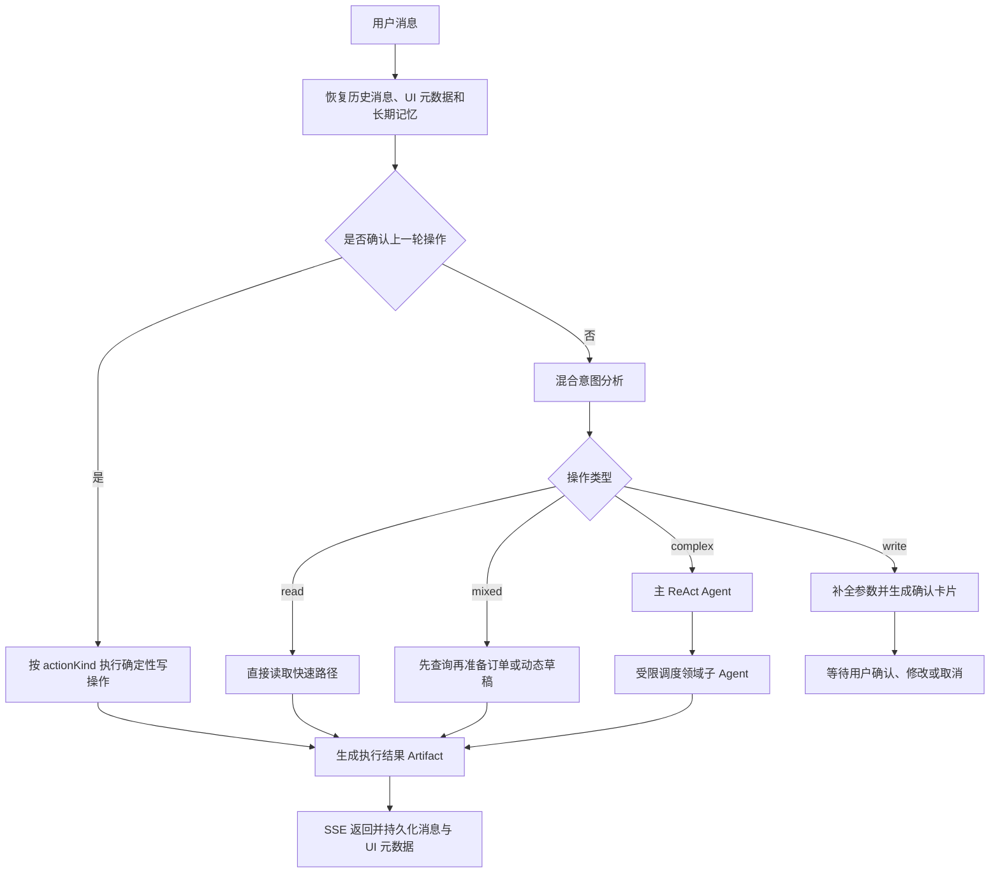

# CampusHub AI Agent 架构与优化演进

## 1. 文档目的

本文基于当前仓库实际代码，说明 CampusHub AI Agent 的系统边界、请求执行流程、多 Agent 调度、写操作确认、SSE 事件、长期记忆，以及从基础版本逐步优化到当前版本的过程。

核心实现位于：

- `CampusHubAgent/app/agent.py`：意图分析、确认机制、直接读取、多 Agent 调度、Artifact 和记忆过滤。
- `CampusHubAgent/app/tools*.py`：订单、动态、用户和时间工具。
- `CampusHubAgent/app/mcp_tools.py`：高德地图 MCP SSE 客户端及地图工具。
- `CampusHubAgent/app/main.py`：FastAPI `/chat`、`/stream`、`/extract-memory` 接口。
- `CampusHubBackend/.../AgentStreamService.java`：Java 后端的 SSE 代理、消息持久化和记忆提交。
- `CampusHubAgent/scripts/run_agent_quality_suite.py`：Agent 统一回归质量门禁。

## 2. 当前架构结论

当前实现不是一个完全依赖大模型自由决策的 Agent，而是“确定性业务编排 + LangGraph ReAct Agent”的混合架构：

1. 业务代码先恢复多轮上下文并判断用户是否在确认上一轮操作。
2. 意图路由层区分只读、写入和先读后写任务。
3. 高频、明确的请求由确定性快速路径直接执行。
4. 写操作必须先生成确认草稿，确认后按固定 `actionKind` 执行。
5. 只有复杂任务才进入主 ReAct Agent，由其受限调度领域子 Agent。
6. Java 后端通过 SSE 转发意图、执行步骤、Artifact、记忆提交和最终文本。



## 3. 服务调用链

### 3.1 多端入口

Vue Web 和 uni-app App 不直接调用 Python Agent，而是调用 Java 后端 `/api/v1/agent`：

```text
Web / App
  -> Spring Boot AgentController
  -> AgentStreamService / PythonAgentClient
  -> FastAPI /stream
  -> CampusHub Agent
  -> Java REST API / 高德地图 MCP / 大模型
```

这样设计的作用是：

- 会话、消息、用户身份和长期记忆统一由 Java 后端管理。
- Agent 调用既能复用现有业务 REST API，也不会绕过业务层直接修改数据库。
- Web 和 App 使用同一套对话协议及结构化 UI 数据。

### 3.2 Python Agent 接口

FastAPI 提供：

- `GET /health`：健康检查。
- `POST /chat`：非流式调用。
- `POST /stream`：SSE 调用。
- `POST /extract-memory`：从普通对话中提取候选长期记忆。

请求包含当前用户、长期记忆、最近历史和本轮消息。Agent 的业务工具通过 `httpx` 请求 Java `/api/v1` 接口，并携带 `X-User-Id`。

## 4. 当前请求执行流程

### 4.1 优先识别确认、修改和取消

`chat()` 首先调用确认执行识别逻辑。系统会从历史消息保存的确认 Artifact 中恢复：

- `actionKind`：要执行的业务动作。
- `fields`：草稿字段和值。
- `missingFields`：仍缺少的必要字段。
- 上一轮关联的订单、动态、地点或用户 ID。

因此用户可以使用自然表达继续操作：

- “确认发布”——执行原草稿。
- “人数改成 4 个”——保留原动作并更新字段，再次确认。
- “就选第二个”——从上一轮候选 Artifact 恢复目标对象。
- “算了”——取消草稿，不执行写入。

当前已实现的确认执行动作包括：

- 创建活动订单。
- 申请、撤销申请、接受申请、拒绝申请、完成订单。
- 发布动态、评论、点赞或取消点赞。
- 保存或删除长期记忆。

### 4.2 意图分析结果

若本轮不是确认操作，则调用 `analyze_intent()`，返回结构化路由结果：

```json
{
  "primary_intent": "order.create",
  "domain": "order",
  "operation_type": "write",
  "requires_confirmation": true,
  "confidence": 0.93,
  "summary": "用户想创建篮球约伴活动",
  "missing_slots": ["活动时间"],
  "suggested_agents": ["order_draft"],
  "next_action": "ask_clarification"
}
```

主要意图包括：

| 意图 | 说明 |
| --- | --- |
| `order.search` | 搜索、查看活动订单 |
| `order.create` | 创建活动订单 |
| `order.manage` | 申请、审批、完成等订单操作 |
| `content.search` | 浏览、搜索动态 |
| `content.create` | 发布动态 |
| `content.interact` | 评论、点赞 |
| `map.search` | POI、周边和路线查询 |
| `weather.query` | 天气查询和活动适宜性判断 |
| `user.profile` | 用户资料或用户搜索 |
| `memory.manage` | 保存或删除长期记忆 |
| `multi_step` | 跨领域、先读后写任务 |
| `chat.general` | 能力介绍和普通问答 |

### 4.3 混合路由策略

路由不是单次 LLM 分类，而是按优先级组合多种策略：

1. 命中意图缓存时复用最近结果。
2. 检测基于上一轮地图、订单、动态结果的上下文操作。
3. 检测明确写操作或先读后写任务，进入安全路径。
4. 检测草稿取消或草稿修改。
5. 检测普通帮助请求。
6. 检测明确只读请求，进入直接读取路径。
7. 仍不确定时调用轻量路由模型。
8. 低置信度、未知意图或潜在读写冲突时调用主模型复核。
9. 路由模型超时或失败时，对明确只读请求使用本地安全降级。

这种设计让模型负责语义理解，但由代码负责安全边界、状态恢复和失败兜底。

### 4.4 读、写和混合任务

- `read`：直接执行，不需要确认，例如查天气、搜地点、浏览订单。
- `write`：必须生成确认草稿，例如创建订单、发布动态、点赞。
- `mixed`：先执行查询，再基于结果准备写操作，但不能直接写入。

典型混合请求：

> 找一下良乡校区附近适合三个人吃饭的地方，合适的话再创建约饭活动，但创建前先问我。

系统会设置：

```text
primary_intent = multi_step
operation_type = mixed
read_then_write_target = order
suggested_agents = map_weather + order_draft
```

第一轮返回地点候选；用户选择地点后，系统继承名称、地址和坐标生成订单草稿；再次确认后才调用创建订单 Tool。

## 5. 多 Agent 与 Tool 设计

### 5.1 主 Agent 和子 Agent

主 Agent 使用 LangGraph `create_react_agent`，但只挂载三个委派工具：

- `call_order_agent`：订单专家。
- `call_social_agent`：动态与用户专家。
- `call_map_agent`：地图天气专家。

每个子 Agent 内部也是一个带领域工具集的 ReAct Agent。这属于 Sub-agent as Tool 架构：主 Agent 负责拆解和调度，子 Agent 负责领域内工具选择。

### 5.2 24 个领域工具

| 分组 | 数量 | 能力 |
| --- | ---: | --- |
| 订单工具 | 10 | 搜索、创建、我的订单、详情、申请、撤销、申请列表、接受、拒绝、完成 |
| 动态工具 | 5 | 搜索、详情、发布、评论、点赞 |
| 用户工具 | 2 | 用户资料、用户搜索 |
| 高德 MCP 工具 | 6 | POI、周边、天气、地理编码、步行路线、驾车路线 |
| 实用工具 | 1 | 当前日期时间 |
| 合计 | 24 | 17 个 Java REST Tool、6 个 MCP Tool、1 个本地工具 |

主 Agent 的三个委派 Tool 不计入上述领域工具数量。

### 5.3 调度保护

为了避免主 Agent 自由委派导致循环和越界，当前实现加入：

- 根据 `primary_intent`、`domain` 和 `suggested_agents` 构建本轮允许列表。
- 单领域请求不允许调用无关子 Agent。
- 限制每个子 Agent 和本轮总委派次数。
- 主 Agent、子 Agent 都设置 recursion limit。
- 完全相同的任务复用已有结果。
- 语义相近的任务根据签名相似度复用结果。
- 子 Agent 设置超时，失败后返回可解释状态。

## 6. 写操作确认机制

写操作确认分为四个阶段：

1. **分类**：将请求识别为 `write` 或 `mixed`。
2. **草稿**：抽取字段，生成 `confirmation` Artifact。
3. **交互**：用户可以确认、修改字段或取消。
4. **执行**：根据固定 `actionKind` 调用确定的业务 Tool。

确认机制不是只靠 Prompt 约束。即使主 Agent 尝试越过确认，`_requires_confirmation_gate()` 仍会在业务代码层拦截写操作。

这一设计避免：

- 用户只是询问，Agent 却直接创建数据。
- 用户确认订单草稿时被错误执行为发布动态。
- 修改草稿字段后丢失原操作类型。
- “先查询再决定”被误判为立即写入。

## 7. 结构化 Artifact 和 SSE

### 7.1 事件类型

当前 SSE 可返回：

- `intent`：结构化意图结果。
- `agent_step`：路由、查询、委派和整理阶段。
- `confirm_required`：需要确认的写操作。
- `artifact`：订单、动态、地点、路线、天气、用户和确认卡片。
- `memory_commit`：明确确认的记忆操作。
- `delta`：回复文本。
- `error`：错误信息。
- `done`：本轮完成。

### 7.2 Java 后端的职责

`AgentStreamService` 会：

1. 保存用户消息。
2. 构造历史消息和长期记忆。
3. 调用 Python `/stream`。
4. 实时转发执行事件。
5. 合并 UI 操作和 Artifact。
6. 保存完整助手回复及 `uiMetadata`。
7. 应用明确确认的长期记忆，再异步提取普通对话中的隐式记忆。

### 7.3 当前流式边界

执行过程中的 `agent_step`、`intent`、`artifact` 等事件是真实实时产生并转发的。

当前最终文本不是底层模型逐 Token 直接输出：Python `stream_chat()` 等待 `chat()` 完成后，将最终回复按小块发送为 `delta`。因此更准确的说法是“基于 SSE 的渐进式事件和文本返回”，而不是“完整的模型 Token 流式推理”。

## 8. 长期记忆

基础版本在每轮对话结束后调用模型提取记忆。当前实现增加两条路径：

### 8.1 隐式提取

从普通对话中提取稳定的用户偏好、事实和行为习惯，并过滤：

- 当天的天气和临时计划。
- 工具查询结果。
- 低置信度或无信息输出。
- 只在当前会话成立的短期内容。

### 8.2 显式管理

当用户说“以后推荐时记住我不吃辣”时，识别为 `memory.manage/write`，先生成确认卡片。用户确认后发出 `memory_commit`，由 Java 后端保存或删除记忆。

## 9. 从基础版本到当前版本的优化过程

### 阶段一：单 Agent + 全部工具

最初只有一个 `create_react_agent(llm, ALL_TOOLS)`，所有订单、社交和地图工具都交给同一个 Agent。

优点是开发快；问题是工具增加后选择不稳定、领域容易混淆、写操作缺少强制确认、过程不可观察。

### 阶段二：主 Agent + 三类子 Agent

将工具按订单、社交、地图天气分组，主 Agent 只调用三个子 Agent。领域 Prompt 和工具范围更清晰，但主 Agent 仍可能重复委派或调错领域。

### 阶段三：结构化进度事件

提交 `bd6bdd0a` 增加 `agent_step` 等结构化进度，使前端能展示路由、专家执行和结果整理过程。

### 阶段四：写操作确认

提交 `ebfea65b` 增加确认卡片；后续继续补齐确认后的真实执行、简短确认语句、草稿修改、草稿取消和 `actionKind` 保留。

写操作由“Prompt 要求谨慎”升级为“业务代码强制拦截”。

### 阶段五：意图路由与直接读取

为高频查询和明确安全路径增加确定性规则；复杂和模糊请求才调用路由模型。随后加入缓存、超时、复核和失败降级，减少简单请求的模型调用链路。

### 阶段六：多轮上下文恢复

逐步支持：

- 地图候选 -> 订单草稿。
- 地图候选 -> 动态草稿。
- 订单结果 -> 申请或动态草稿。
- 动态结果 -> 点赞或评论草稿。
- 用户选择“第一条”“第二个”或指定名称。
- 修改和取消上一轮确认草稿。

### 阶段七：调度保护

提交 `577eebb1` 等加入领域允许列表、委派次数限制、递归限制、重复任务复用和语义复用，解决 ReAct 循环和跨领域漂移。

### 阶段八：记忆治理

对自动提取的记忆增加持久性判断和过滤，并为显式记忆修改增加确认提交，避免把天气、工具结果和临时计划存成长期偏好。

### 阶段九：先读后写目标识别

真实测试发现：

> Tomorrow check weather and nearby indoor board game places; if suitable, draft an order but ask me first.

这类请求可能被误判为纯地图查询，或者不能区分最终要创建订单还是动态。

提交 `28dfc24b` 增加 `_read_then_write_target()`，分别识别 `order` 和 `content`，并将 `read_then_write_target`、`suggested_agents` 纳入测试断言。

## 10. 回归测试与质量门禁

统一质量套件覆盖：

- 基础意图分类。
- persona 用户画像表达。
- realistic 真实口语、拼写和中英文混合请求。
- journey 多轮用户旅程。
- direct-read 直接读取路径。
- contextual-order 上下文订单操作。
- memory-filter 长期记忆过滤。
- delegation-guard 子 Agent 委派保护。
- router-fallback 路由失败降级。

最近一次路由强化后的验证结果：

```text
intent base        37/37
persona            33/33
realistic          15/15
journeys           14/14
direct read        15/15
contextual order   27/27
memory filter       4/4
delegation guard    7/7
router fallback     2/2
quality suite       9/9 steps passed
```

## 11. 当前实现边界

- 后端虽然引入 Spring Security 和 JJWT 依赖，但当前普通接口主要是 `permitAll + X-User-Id`，登录 Token 仍为 mock token；不能描述为已完成生产级 JWT 鉴权。
- 管理接口通过 `AdminAuthInterceptor` 校验用户类型，但仍依赖 `X-User-Id`。
- Python Agent 使用 LangGraph 预构建 `create_react_agent`，没有自行实现完整 `StateGraph` 工作流。
- SSE 执行事件是实时的，最终文本目前为完成后分块发送。
- Agent 写操作最终调用 Java REST API，不直接写 MySQL。
- 地图能力依赖外部高德 MCP SSE 服务，外部服务异常时会返回超时或连接错误。

## 12. 一句话总结

CampusHub Agent 的核心优化方向，是把早期“模型自由选择全部工具”的 Demo，逐步改造成“代码控制边界、模型负责语义与规划、工具执行真实业务、SSE 提供可观察过程、回归测试保障多轮行为”的可控业务 Agent。
