# 校园约伴平台 — UML 设计

> 校内活动预约与分享平台（CampusHub）  
> 基于代码库 `CampusHubBackend` / `CampusHubApp` / `CampusHubWeb` / `CampusHubAgent` 绘制  
> 可使用 [Mermaid Live Editor](https://mermaid.live) 或 VS Code Mermaid 插件预览与导出 PNG/SVG

**Draw.io 可视化源文件**：见 [`drawio/`](./drawio/) 目录，内含 12 张 `.drawio` 图、每张图的说明与 Mermaid 源码，可用 [diagrams.net](https://app.diagrams.net) 直接打开并导出 PNG/PDF。

---

## 1. 用例图（Use Case）

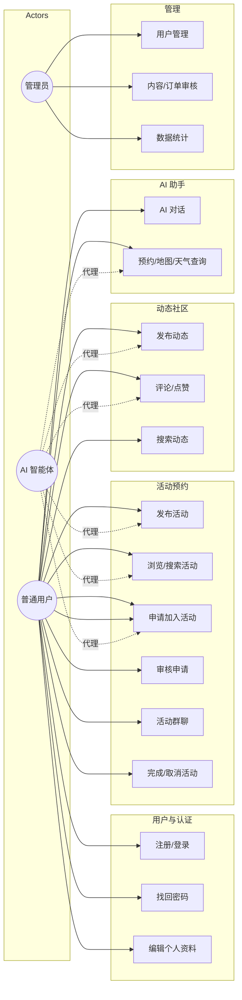

**说明**：写操作类用例（创建订单、发评论等）在 AI 场景下需用户确认后执行；管理员拥有用户类型变更、强制删帖等扩展权限。

---

## 2. 组件图（Component）

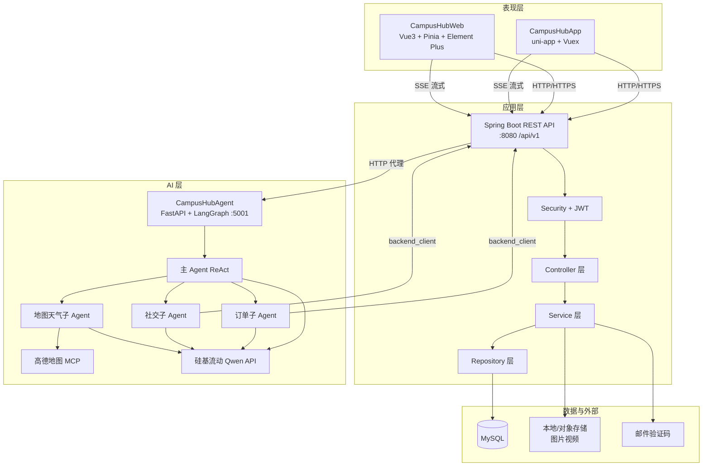

---

## 3. 部署图（Deployment）

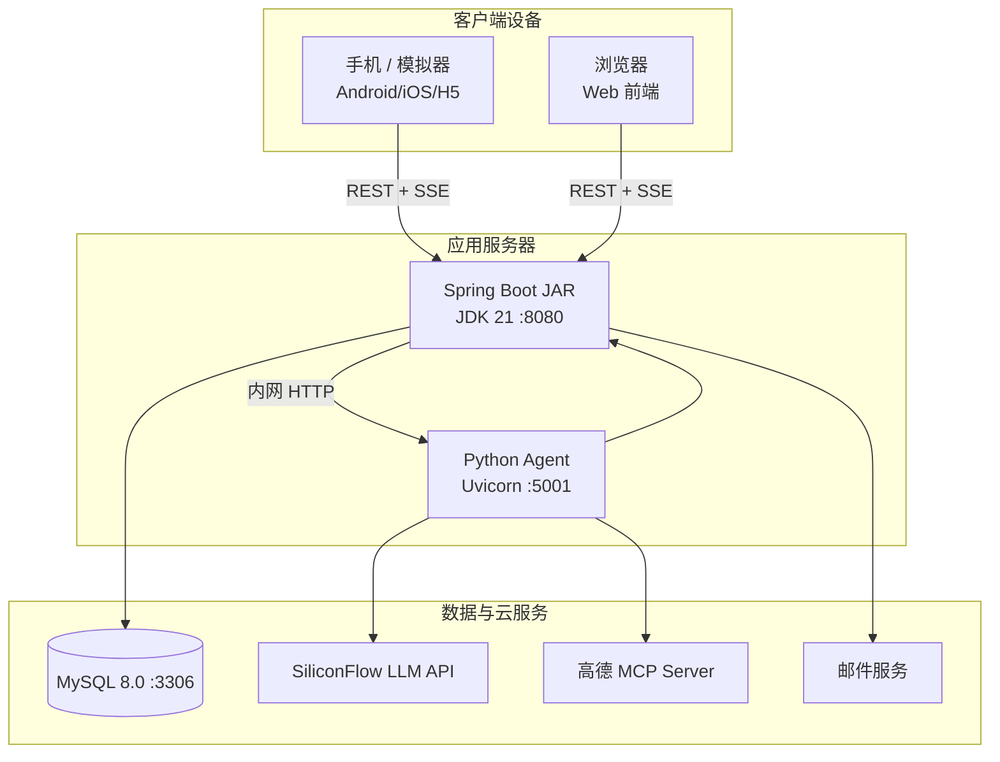

---

## 4. 领域类图（实体 ER / Class）

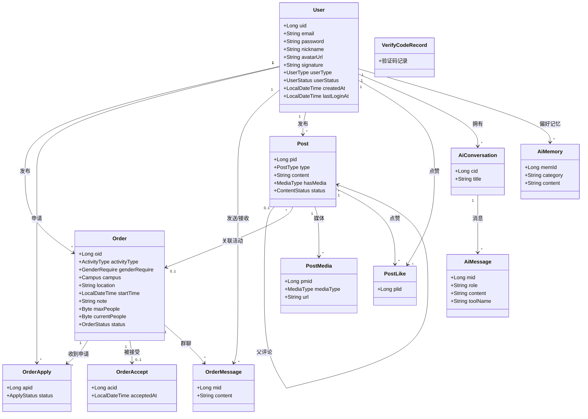

---

## 5. 后端分层类图（简化）

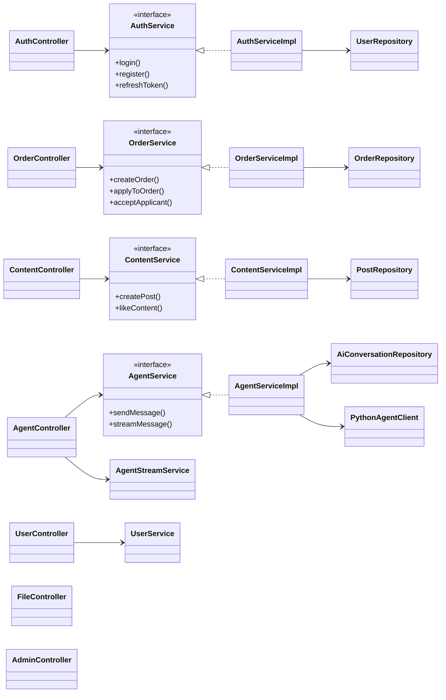

---

## 6. AI 多智能体类图（概念）

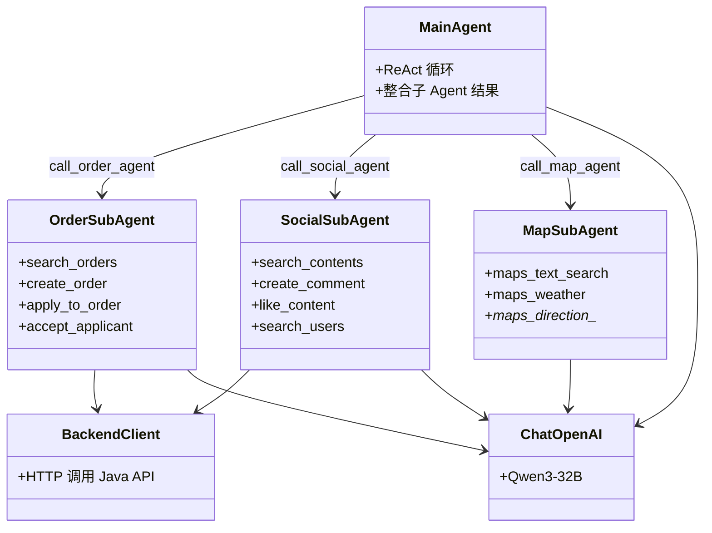

---

## 7. 时序图 — 用户登录

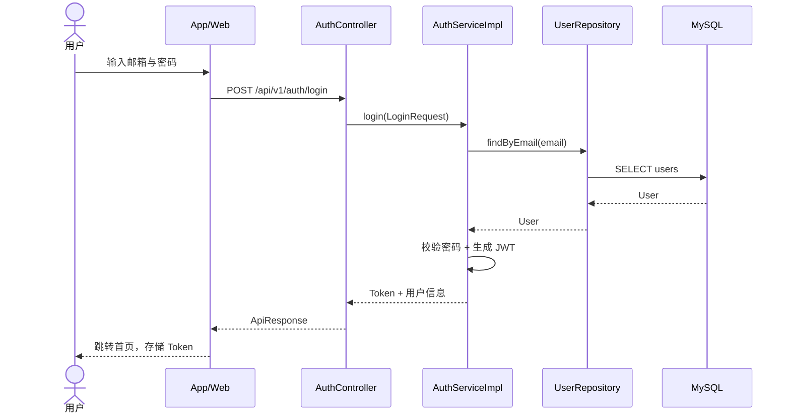

---

## 8. 时序图 — 申请加入活动

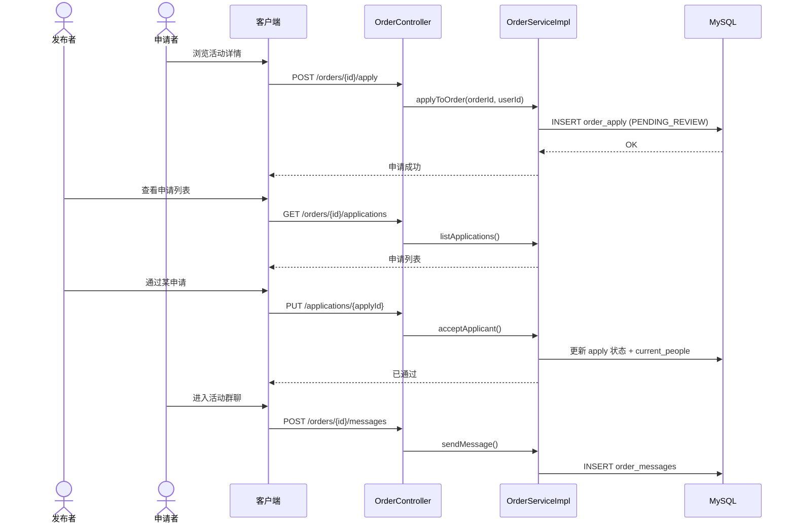

---

## 9. 时序图 — AI 流式对话（SSE）

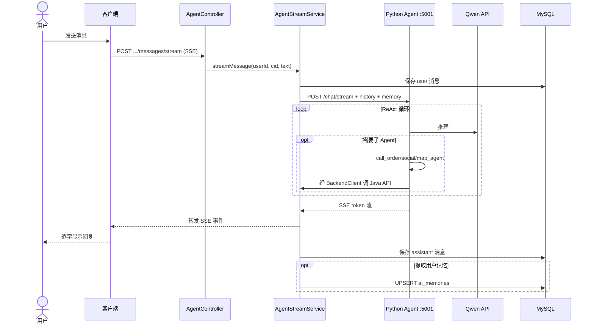

---

## 10. 状态图 — 订单生命周期

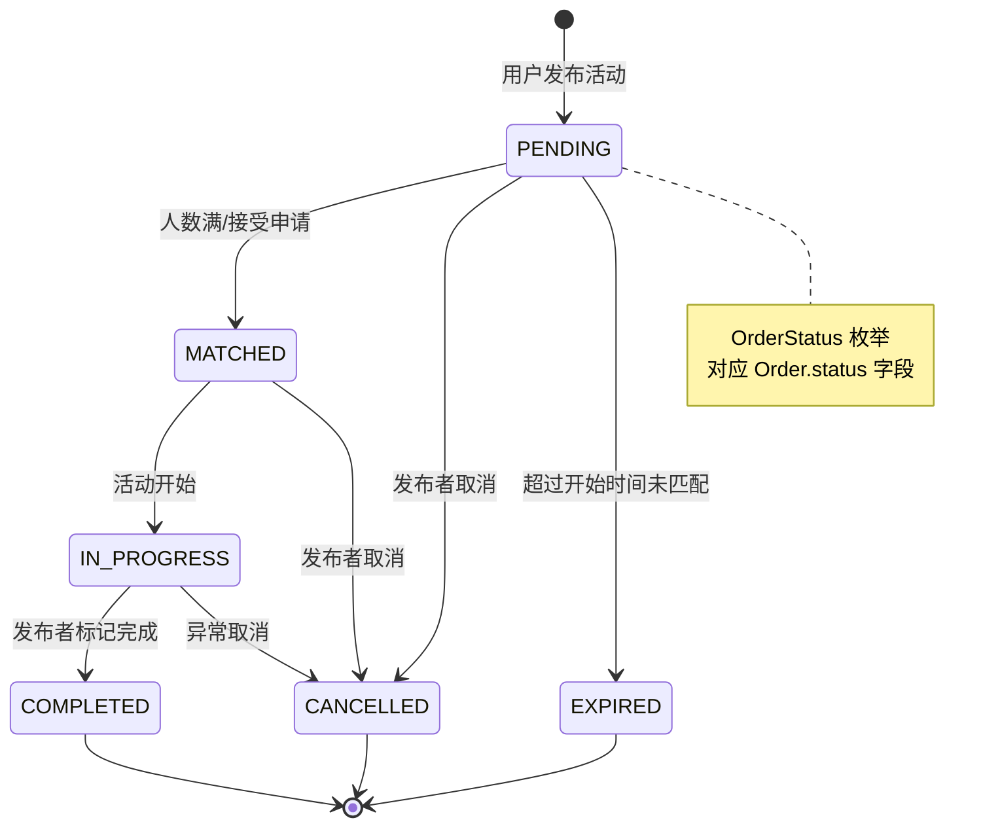

---

## 11. 状态图 — 活动申请

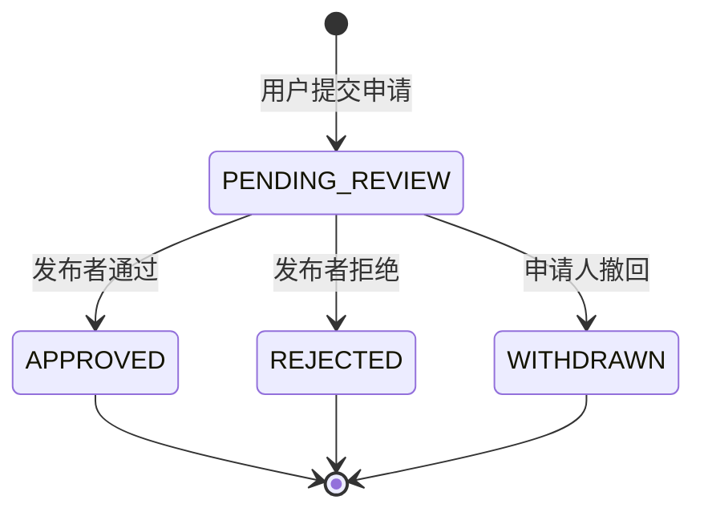

---

## 12. 活动图 — 发布动态（含媒体）

```mermaid
flowchart TD
    Start([开始]) --> Auth{已登录?}
    Auth -->|否| Login[跳转登录]
    Auth -->|是| Edit[编辑正文]
    Edit --> HasMedia{含图片/视频?}
    HasMedia -->|是| Upload[POST /upload/image|video]
    Upload --> Create[POST /api/v1/contents]
    HasMedia -->|否| Create
    Create --> Attach{有媒体?}
    Attach -->|是| Media[POST /contents/{id}/media]
    Attach -->|否| Done
    Media --> Done([发布成功，刷新列表])
    Login --> End([结束])
    Done --> End
```

---

## 13. 包图（Package）— 后端模块划分

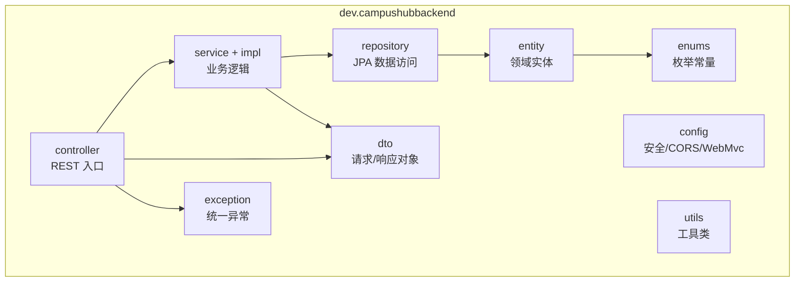


---

## 图例与版本

| 图类型 | 用途 |
|--------|------|
| 用例图 | 需求范围、角色与功能边界 |
| 组件/部署图 | 系统架构与运维部署 |
| 类图 | 数据模型与分层设计 |
| 时序图 | 关键业务流程交互 |
| 状态/活动图 | 订单/申请状态与操作流程 |

**文档版本**：v1.0 | **对应代码分支**：CampusHub 主仓库
