# 校园约伴平台 — Draw.io UML 图集

本目录提供 **可直接打开、编辑、导出 PNG/PDF/SVG** 的 draw.io 源文件（`.drawio`），每张图均附 **文字说明** 与 **Mermaid 源码**（便于版本管理与二次渲染）。

## 如何打开

| 方式 | 操作 |
|------|------|
| 在线 | 打开 [https://app.diagrams.net](https://app.diagrams.net) → **文件 → 打开** → 选择本目录下 `.drawio` |
| VS Code | 安装 **Draw.io Integration** 扩展 → 双击 `.drawio` |
| 桌面版 | 下载 [draw.io Desktop](https://github.com/jgraph/drawio-desktop/releases) |

导出图片：**文件 → 导出为 → PNG / SVG / PDF**（建议 PNG 300dpi 用于论文）。

重新生成全部图（修改布局后）：

```bash
py -3 docs/SystemAnalysis/drawio/generate_drawio.py
```

---

## 图集清单

| 序号 | 文件 | 类型 |
|------|------|------|
| 01 | [01-用例图.drawio](./01-用例图.drawio) | 用例图 |
| 02 | [02-组件图.drawio](./02-组件图.drawio) | 组件图 |
| 03 | [03-部署图.drawio](./03-部署图.drawio) | 部署图 |
| 04 | [04-领域类图.drawio](./04-领域类图.drawio) | 类图 |
| 05 | [05-后端分层类图.drawio](./05-后端分层类图.drawio) | 类图 |
| 06 | [06-AI智能体类图.drawio](./06-AI智能体类图.drawio) | 类图 |
| 07 | [07-时序图-用户登录.drawio](./07-时序图-用户登录.drawio) | 时序图 |
| 08 | [08-时序图-申请加入活动.drawio](./08-时序图-申请加入活动.drawio) | 时序图 |
| 09 | [09-时序图-AI流式对话.drawio](./09-时序图-AI流式对话.drawio) | 时序图 |
| 10 | [10-状态图-订单生命周期.drawio](./10-状态图-订单生命周期.drawio) | 状态图 |
| 11 | [11-状态图-活动申请.drawio](./11-状态图-活动申请.drawio) | 状态图 |
| 12 | [12-包图.drawio](./12-包图.drawio) | 包图 |

---

## 01 用例图

**文件**：`01-用例图.drawio`

**说明**：描述三类参与者与系统功能的关联。**普通用户**覆盖认证、活动预约、动态社区、AI 助手；**管理员**负责用户治理、内容与订单审核、统计；**AI 智能体**以虚线「代理」方式关联部分用例，写操作（创建订单、发评论等）在 AI 场景下需用户确认。发布者同时承担「审核申请」。

**Mermaid 源码**：

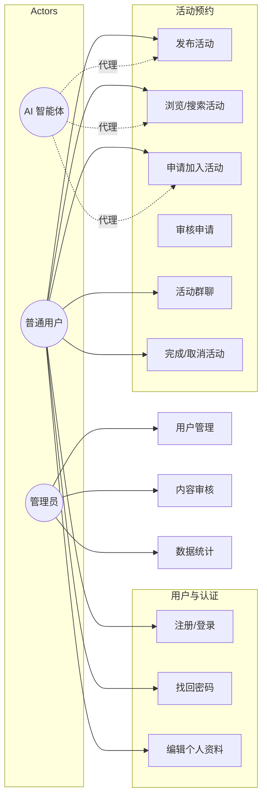

---

## 02 组件图

**文件**：`02-组件图.drawio`

**说明**：四端架构的逻辑组件及依赖。App/Web 经 HTTP/SSE 访问 Spring Boot；后端分层为 Security → Controller → Service → Repository → MySQL；AI 请求由 Java 代理至 Python Agent，主 Agent 调度三个子 Agent，订单/社交子 Agent 通过 `backend_client` 回调 Java API，地图子 Agent 连接高德 MCP。

**Mermaid 源码**：

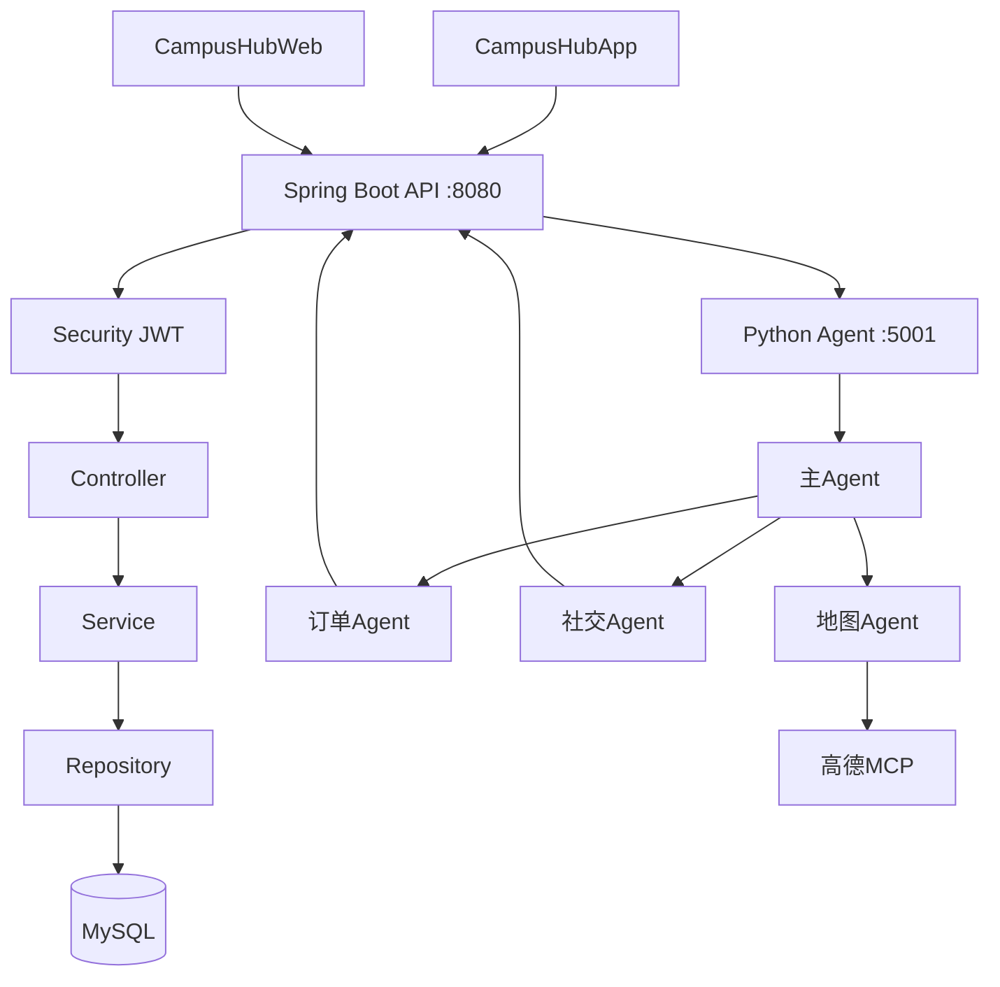

---

## 03 部署图

**文件**：`03-部署图.drawio`

**说明**：物理/逻辑部署节点。客户端（手机模拟器、浏览器）访问应用服务器上的 Spring Boot（8080）与 Python Agent（5001）；JVM 连接 MySQL、SMTP；Agent 连接 SiliconFlow LLM 与高德 MCP。

**Mermaid 源码**：

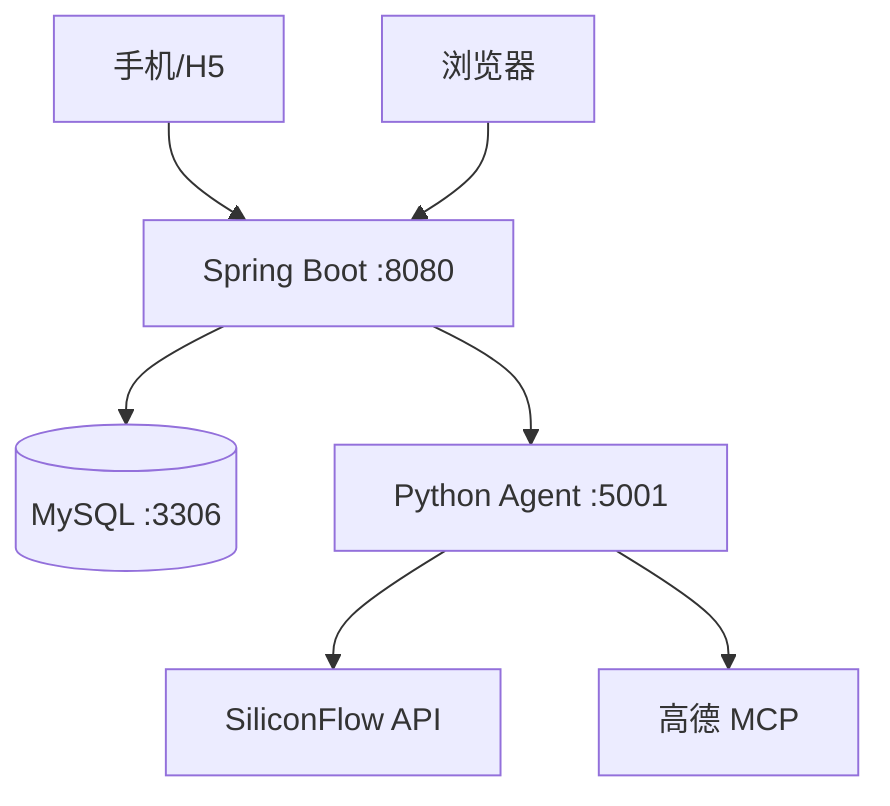

---

## 04 领域类图

**文件**：`04-领域类图.drawio`

**说明**：JPA 实体及关联 cardinality。`User` 为中心：`Order`、`Post`、`OrderApply`、`AiConversation`、`AiMemory` 等；`Post` 自关联实现评论树，可选关联 `Order`；`Order` 与 `OrderApply`、`OrderAccept`、`OrderMessage` 构成活动域。

**对应代码包**：`CampusHubBackend/.../entity/`

**Mermaid 源码**（节选）：

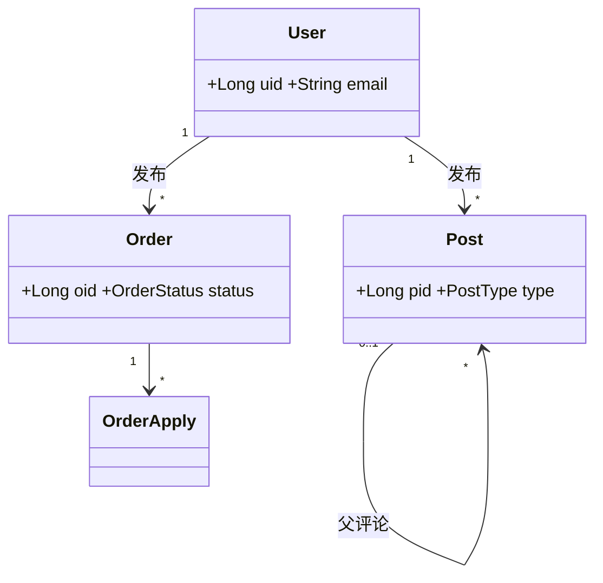

---

## 05 后端分层类图

**文件**：`05-后端分层类图.drawio`

**说明**：典型 Spring 三层 + AI 代理。Controller 依赖 Service 接口；实现类依赖 Repository；`AgentServiceImpl` 与 `AgentStreamService` 共用 `PythonAgentClient` 调用 FastAPI。

**Mermaid 源码**：

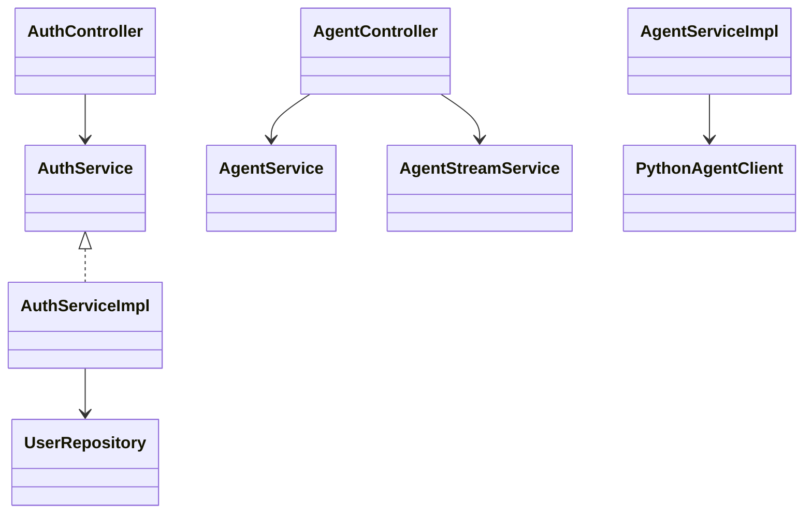

---

## 06 AI 智能体类图

**文件**：`06-AI智能体类图.drawio`

**说明**：`CampusHubAgent/app/agent.py` 中的多智能体结构。主 Agent ReAct 循环调用 `call_order_agent`、`call_social_agent`、`call_map_agent` 三个 LangChain Tool，子 Agent 内部再调用原子工具与 LLM。

**Mermaid 源码**：

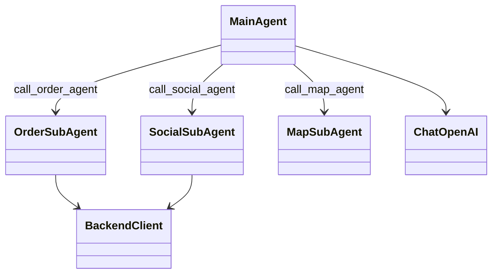

---

## 07 时序图 — 用户登录

**文件**：`07-时序图-用户登录.drawio`

**说明**：`POST /api/v1/auth/login` 完整链路。客户端提交凭证 → `AuthController` → `AuthServiceImpl` 查库校验 → 生成 JWT → 返回 `ApiResponse`，客户端持久化 Token。

**关键代码**：

- `AuthController.java` — `@PostMapping("/login")`
- `AuthServiceImpl.java` — `login(LoginRequest)`

**Mermaid 源码**：

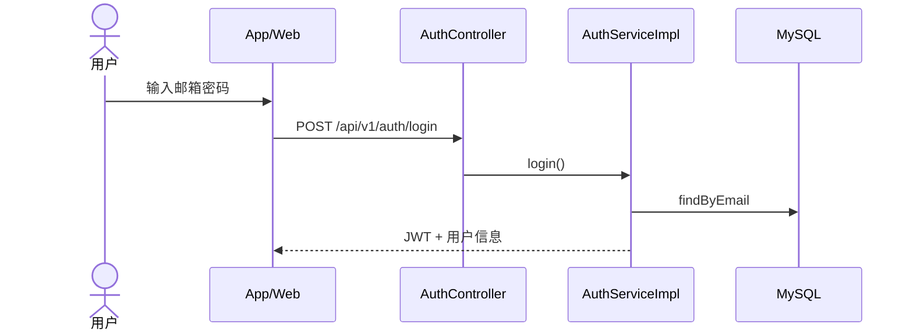

---

## 08 时序图 — 申请加入活动

**文件**：`08-时序图-申请加入活动.drawio`

**说明**：申请者 `POST /orders/{id}/apply` 写入 `order_apply`；发布者 `GET /applications` 与 `PUT /applications/{applyId}` 审核；通过后双方可使用 `POST /orders/{id}/messages` 群聊。

**Mermaid 源码**：

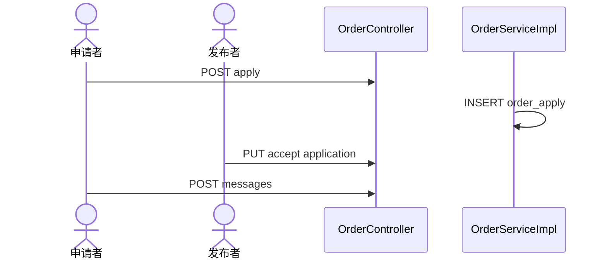

---

## 09 时序图 — AI 流式对话

**文件**：`09-时序图-AI流式对话.drawio`

**说明**：客户端订阅 SSE 端点 `POST .../messages/stream`。`AgentStreamService` 持久化用户消息后转发至 Python Agent；Agent 经 ReAct 可能调用子 Agent 与 Java API；token 流式返回并落库 `ai_messages`。

**Mermaid 源码**：

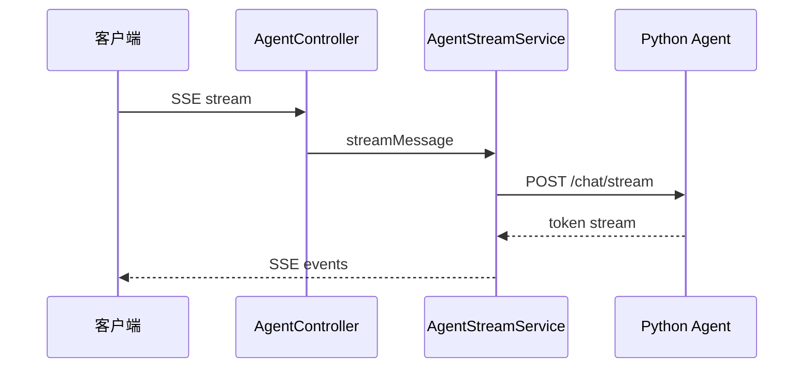

---

## 10 状态图 — 订单生命周期

**文件**：`10-状态图-订单生命周期.drawio`

**说明**：`Order.status` 字段状态机。从 `PENDING` 可转入 `MATCHED`、`EXPIRED`、`CANCELLED`；匹配后进入 `IN_PROGRESS`，最终 `COMPLETED` 或取消。

**枚举**：`dev.campushubbackend.enums.OrderStatus`

**Mermaid 源码**：

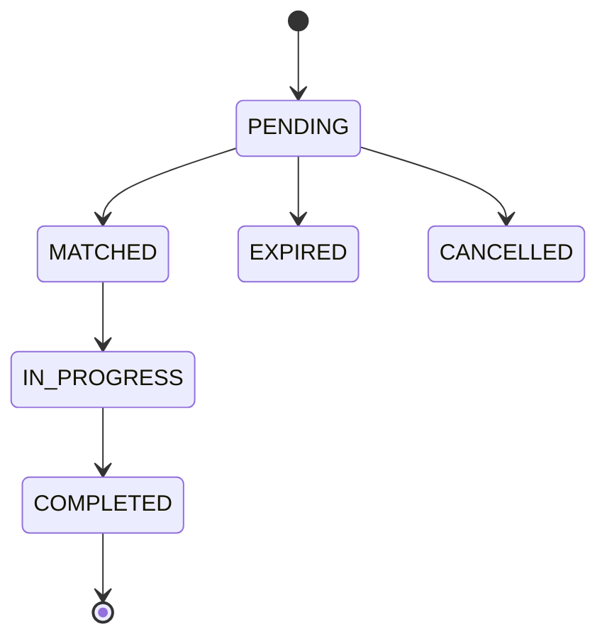

---

## 11 状态图 — 活动申请

**文件**：`11-状态图-活动申请.drawio`

**说明**：`OrderApply.status` 从 `PENDING_REVIEW` 到 `APPROVED` / `REJECTED` / `WITHDRAWN`。表级唯一约束 `(oid, uid)` 保证同一用户对同一活动仅申请一次。

**Mermaid 源码**：

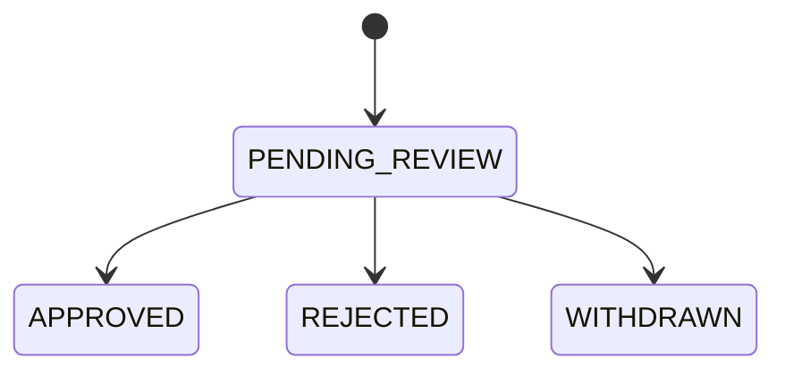

---

## 12 包图

**文件**：`12-包图.drawio`

**说明**：`dev.campushubbackend` 包依赖：`controller → service → repository → entity`；`dto`、`enums`、`exception`、`config` 为横切支撑。

**Mermaid 源码**：

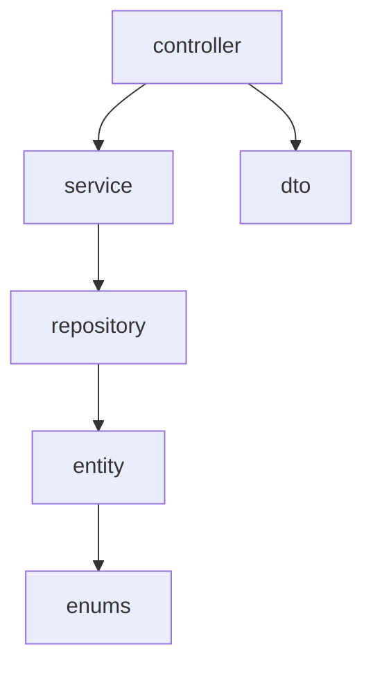

---

## 目录结构

```
drawio/
├── README.md                 # 本说明（含每张图的 Mermaid 源码）
├── generate_drawio.py        # 生成器（可改布局后重新导出）
├── 01-用例图.drawio
├── 02-组件图.drawio
├── …
└── 12-包图.drawio
```

**版本**：v1.0 | 与 `UML设计.md` 及后端 entity 包同步
